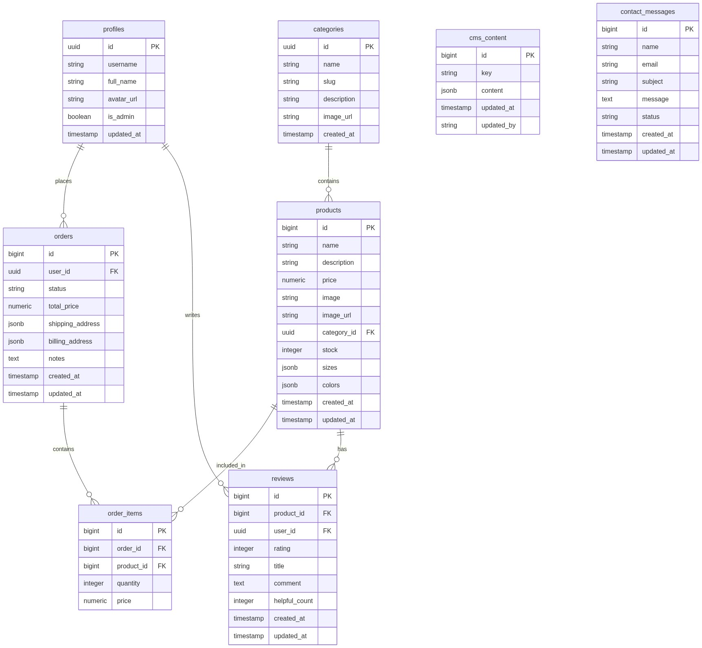
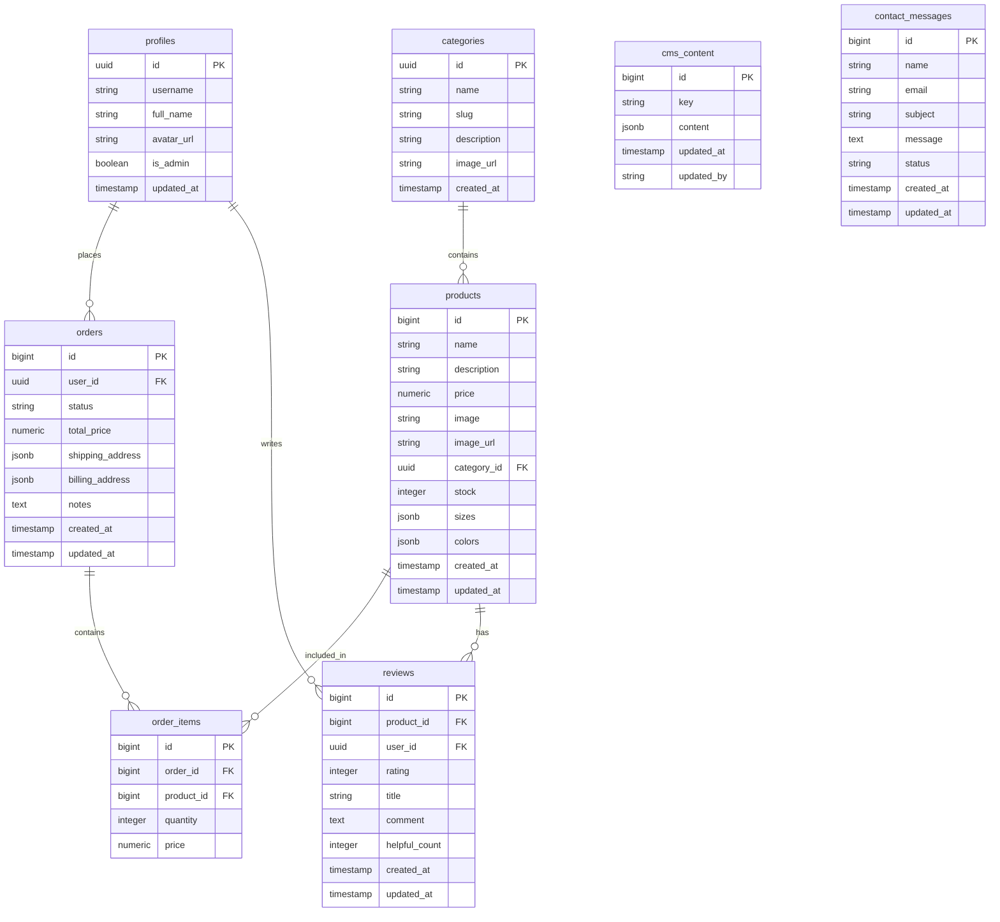

# Entity Relationship Diagram

This diagram represents the database structure based on the `shared/schema.ts` file.

## Tables Overview

- **profiles**: User profiles, likely linked to Supabase Auth.
- **products**: Items available for sale.
- **categories**: Product categories.
- **orders**: Customer orders.
- **order_items**: Individual items within an order (Pivot table between Orders and Products).
- **reviews**: Product reviews left by users.
- **cms_content**: Dynamic content for the CMS (Content Management System).
- **contact_messages**: Messages submitted via the contact form.
