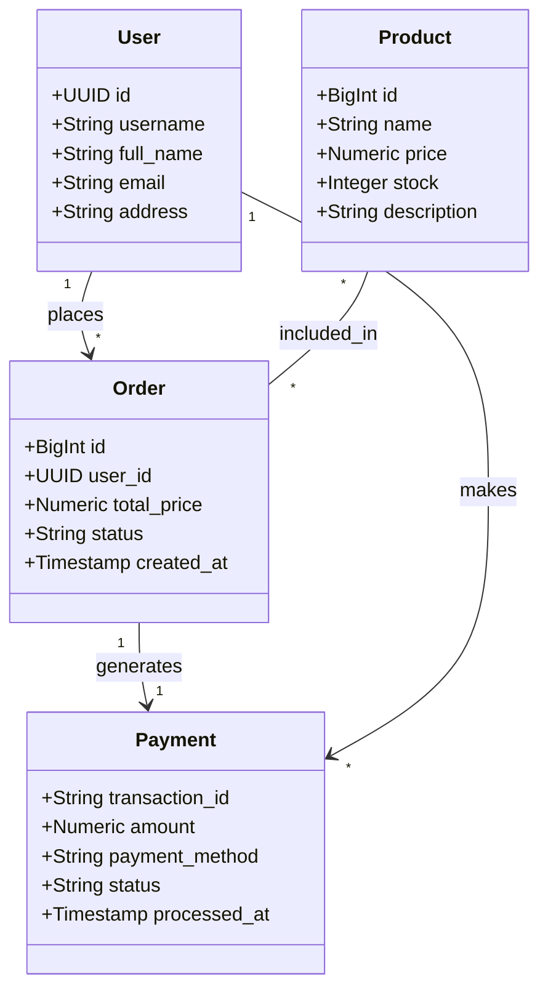
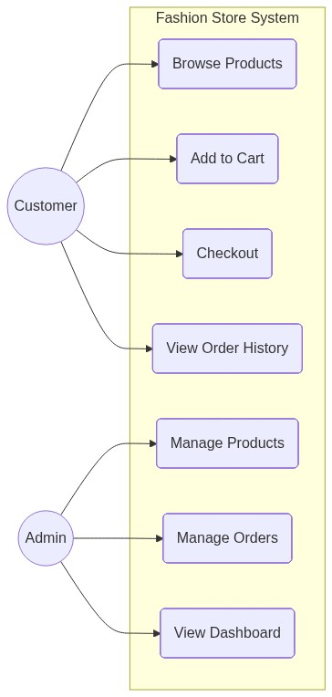
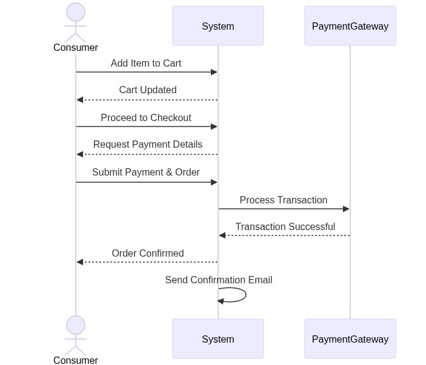
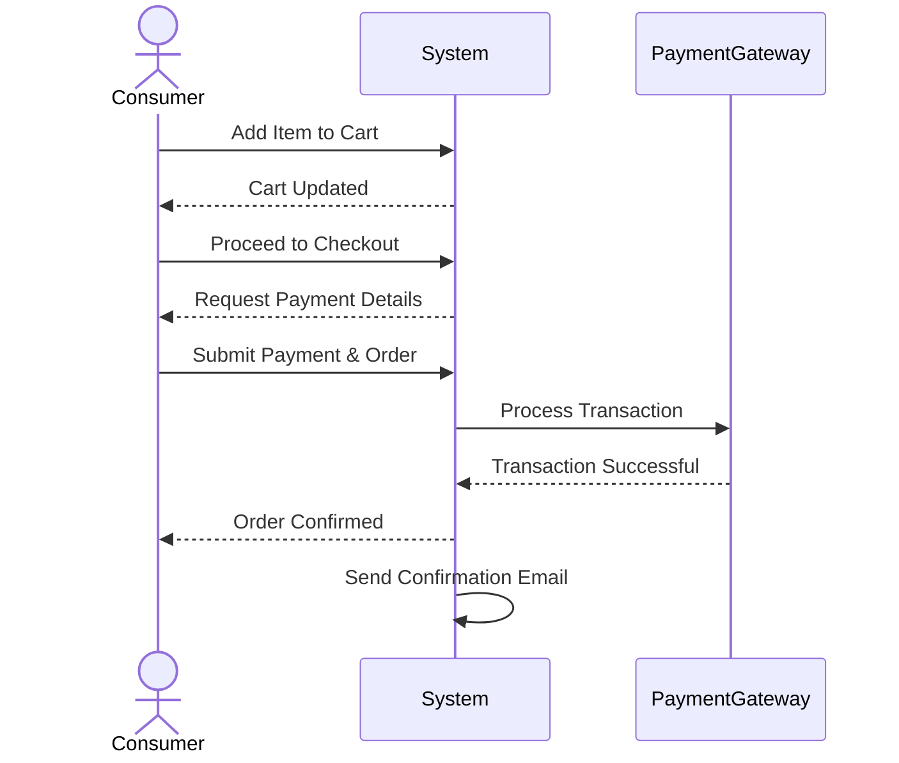
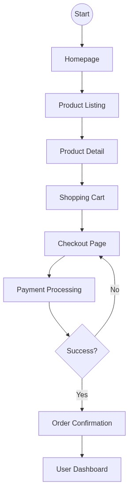
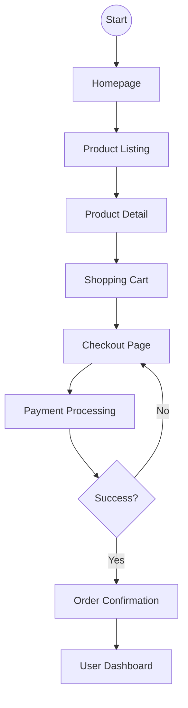

# System Design Diagrams

This document contains the system design diagrams for the project, matching the structure of the provided sketch.

## 1. Entity Relationship Diagram (Conceptual)
A simplified view of the core entities and their relationships.




## 2. Use Case Diagram
Illustrates the interactions between actors (Customer, Admin) and the system.



```mermaid
usecaseDiagram
    actor Customer
    actor Admin

    package "Fashion Store System" {
        usecase "Browse Products" as UC1
        usecase "Add to Cart" as UC2
        usecase "Checkout" as UC3
        usecase "View Order History" as UC4
        
        usecase "Manage Products" as UC5
        usecase "Manage Orders" as UC6
        usecase "View Dashboard" as UC7
    }

    Customer --> UC1
    Customer --> UC2
    Customer --> UC3
    Customer --> UC4

    Admin --> UC5
    Admin --> UC6
    Admin --> UC7
```

## 3. Sequence Diagram (Checkout Flow)
Shows the chronological sequence of messages during the checkout process.





## 4. Customer Journey Flow (UI Map)
Represents the user's navigation flow through the application interface.




